# ELTS Research Software

A Windows Unity application, offline browser simulation and analysis tools for
the built ELTS apparatus. Current operation uses synthetic inputs; testing
equipment is unavailable and this is not a study-ready release.

## Illustrated user guide

Use this guide to run the **development** version of the administrator dashboard.

**Quick flow:** Open → Settings → New participant → Calibration → Practice → ARM TEST → Participant starts → Test saves → Start break → ARM TEST again.

> This version uses synthetic inputs. It is for software rehearsal, not physical equipment validation or study-ready operation. Screenshots show the current interface with fictional demonstration data; the camera feed is not connected in these examples. Click any image on GitHub to enlarge it.

[Open the software](#1-open-the-software) · [Set up tests](#2-arrange-tests-and-set-the-times) · [Add a participant](#3-create-the-participant-recording) · [Run tests](#5-arm-and-run-a-test) · [Breaks](#7-start-the-break-yourself) · [Find data](#8-finish-and-find-the-saved-data)

### 1. Open the software

1. Use your local copy of the repository on the **development** branch. Finish any active session before updating it.
2. Open the project folder and double-click **START-ELTS.cmd**. This is the one button to use: it installs or reuses the required development tools, builds or reuses the verified player, then opens both the administrator dashboard and participant game. On first use, allow setup and the build to finish. Complete any Unity sign-in or license prompts.
3. Two windows open: the **administrator dashboard** in your browser and the **participant game**. You do not need to open the Unity Editor to run a test.

Need the project on a new computer? Follow the [illustrated setup guide](docs/operator/multi-machine-setup.md), choosing **development** for this version. The required Unity version is **6000.3.23f1 LTS**.

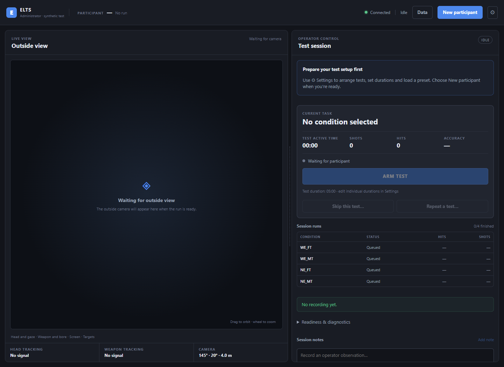

| Where to look | What to do there |
| --- | --- |
| **⚙ Settings**, top right | Arrange tests, adjust times and change window settings. |
| **New participant**, top right | Enter participant details and begin a recording. |
| **Test session**, right pane | Arm, pause, resume, stop and manage breaks. Scroll down for notes and save status. |
| **Outside view**, left pane | Watch the camera view. Drag to orbit; use the mouse wheel to zoom. |
| **Data**, top right | View participant profiles, saved sessions and exports. |

The thin divider between the panes can be dragged to change their widths. Gray buttons become available when their action is allowed.

### 2. Arrange tests and set the times

Before creating a participant, click **⚙ Settings**.

**Set the order:** grab the six-dot handle beside a condition and drag it up or down. Release it to save the order. Press Escape to cancel a drag. You can also focus a handle and use the Up/Down arrow keys. The order locks once a participant session starts.

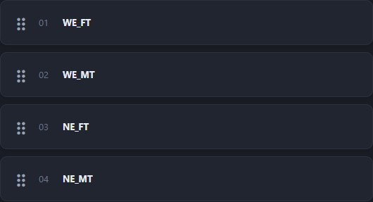

**Set the times:** scroll down to **Durations**.

- **Test durations:** enter seconds for each test. Click outside the field or press Tab, then wait for **Saved**. The default is 300 seconds (5 minutes).
- **Practice** and **Every break:** enter the durations, then click **Save practice & breaks**. The same break duration applies after every test. The 60-second break shown below is an example.

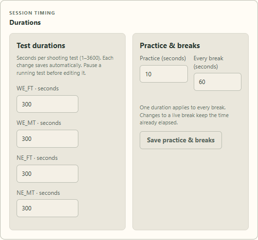

To reuse a setup, enter a **Preset name** under **Saved setups** and click **Save setup** after applying your changes. Later, select it and click **Load** before creating a participant. Presets stay in that browser; load them again after restarting the app.

Close Settings using **×**. You can return to Settings during a session for display controls or permitted timing edits. Pause a running test before changing its duration.

### 3. Create the participant recording

Click **New participant**. Enter the **Participant number / ID**; a name or alias and initial observations are optional. Click **Create recording** and wait for preparation to finish.

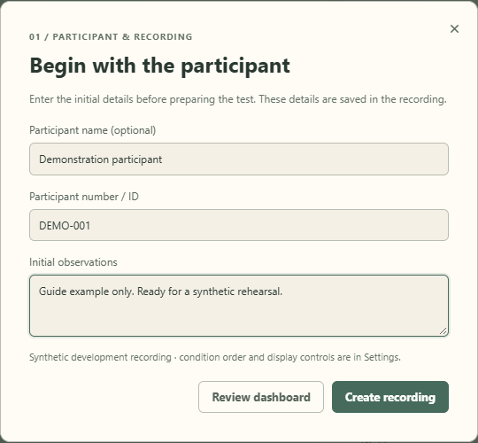

These details are saved with the recording. Creating a recording does not start a shooting test.

### 4. Review calibration and practice

In **Calibration & practice**:

1. Click **Generate fixture**.
2. Read the displayed review. Use **Redo** if you need another fixture.
3. Click **Accept fixture**.
4. Click **Start practice** when the participant is ready.

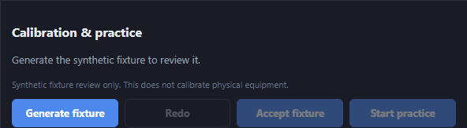

These are synthetic fixture controls; they do not calibrate the physical apparatus.

During practice, let the participant try moving and aiming. Wait for the timer, or click **Finish practice** to end it early. **Restart practice** starts the practice timer again. Practice shots are not scored.

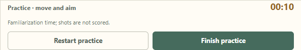

### 5. Arm and run a test

Check the condition and duration in **Current task**. When the participant is ready, click **ARM TEST**.

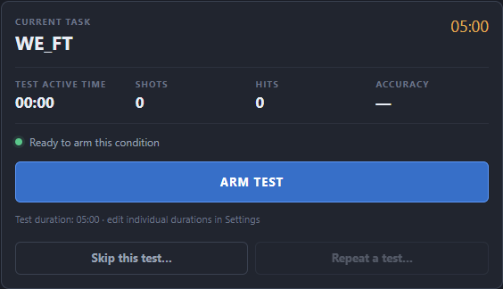

The participant window then says **Shoot to begin**. The participant clicks and releases to start the test; that starting click is not counted as a shot. Before they start, **DISARM TEST** cancels arming.

During the test, the participant aims with the mouse and clicks to shoot. In the synthetic game, W/S moves forward/back, A/D moves left/right, Q/E moves down/up, and R resets the virtual pose.

To resize the participant window, drag its edges. F11 or Alt+Enter toggles fullscreen; Escape returns to the previous window size. Switching windows does **not** pause the timer.

### 6. Pause, stop or record an observation

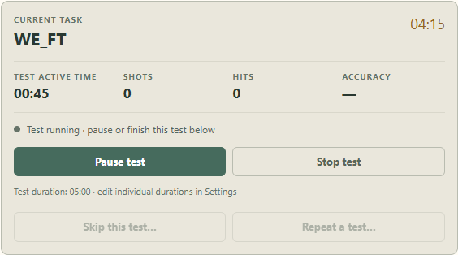

- **Pause test:** holds the timer and targets. Click **Resume test** to continue the same test.
- **Stop test:** asks you to confirm an early finish. Results so far are saved as **Stopped early**; that attempt cannot resume.
- **Session notes:** scroll down, type an observation and click **Add note**. It appears in the saved note history.

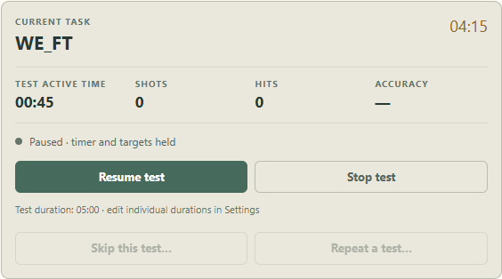

For exceptions, **Skip this test…** skips a ready, disarmed test with a reason. **Repeat a test…** creates another attempt with a reason and preserves the earlier results. **Abort participant session** ends the entire session, including its remaining tests; use it only when you intend to finish that participant's session early.

### 7. Start the break yourself

After each test ends:

1. Wait for the test to finish saving.
2. Click **Start break** when you want the countdown to begin. Waiting before this click does not use any break time.

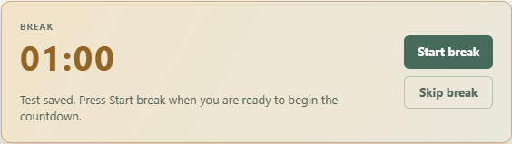

3. Wait for the countdown, or click **Skip break** to finish it early. You can also skip a break before starting its timer.
4. When the next test is ready, click **ARM TEST** yourself. The participant again uses **Shoot to begin**.

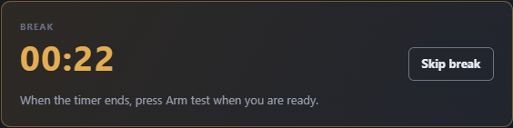

**The timer never arms or starts the next test automatically.** After the final test, complete or skip its break to close the participant recording.

### 8. Finish and find the saved data

Click the small **Data** button at the top. It switches the dashboard to the participant collection. Click **Test administration** to return; switching views does not pause an active test.

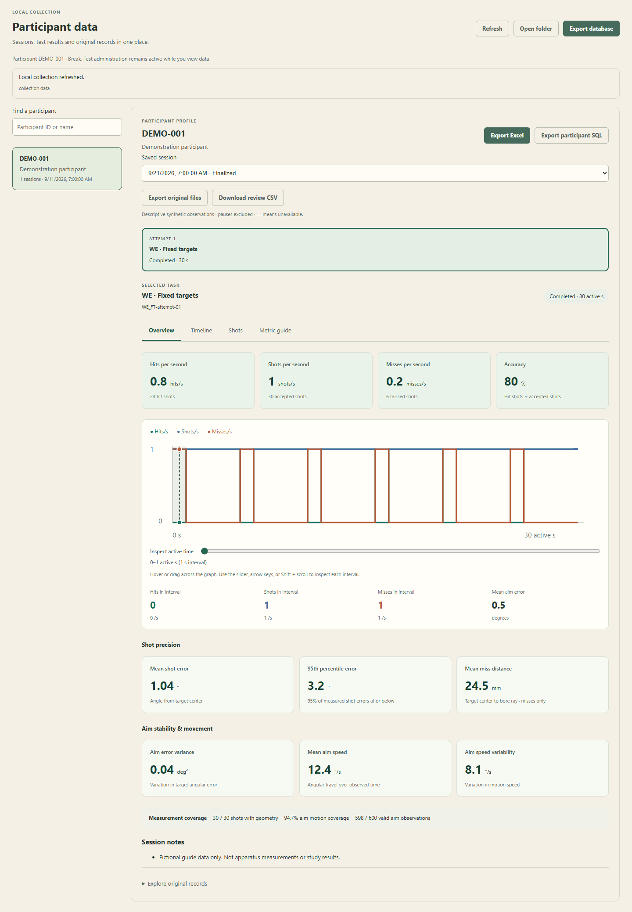

1. Find a participant by ID or name in the left panel. Reusing the same participant ID groups their sessions under one unique profile.
2. Choose a saved session, then a task attempt. **Overview** shows firing rates, accuracy, shot error and aim stability. **Timeline** shows rates per active second; **Shots** lets you inspect hits and misses individually. **Metric guide** explains the units and unavailable values. Expand **Explore original records** for raw JSON.
3. Click **Refresh** to index existing recordings or pick up newly flushed data.

- **Export database:** creates a standalone SQLite snapshot of the whole indexed collection.
- **Export participant:** creates a standalone SQLite database containing only the selected participant and their sessions and records.
- **Export Excel:** creates a filtered workbook for the selected participant with Tasks, Timeline, Shots and Metric guide sheets. SQL exports include matching `task_results`, `task_seconds` and `task_shots` views.
- **Download export:** downloads the prepared file through your browser. Export copies also remain in the data folder's **exports** directory.
- **Export original files:** creates a ZIP of the selected finalized session, preserving the original streams and checksums.
- **Download review CSV:** downloads all task summaries for the selected session, including rates, precision, aim metrics and coverage.
- **Open folder:** opens the actual data folder shown in the viewer. The default is **collection data** beside the README and Start button; an older or customized machine configuration may select another folder.

The data folder and **collection.sqlite** are created when the administrator starts, even before the first participant. Raw data is written continuously. Each finished or skipped test saves a checkpoint and updates its SQL copy; the final recording closure updates SQL again. Exports contain the data indexed through the latest save or refresh. Wait for saving to finish before closing ELTS.

Storage and export failures appear in the Data view and flag its button. If a SQL copy fails, the original raw files remain available; **Refresh** retries indexing. Browser privacy settings that block saved layout preferences do not disable the controls.

The collection is local to this machine and excluded from Git. Pushing the project does not back up recordings or synchronize databases. Older recordings remain in their original folders; the viewer also checks the previous default **data/synthetic** location beside the current default folder. A standalone player copied outside the project saves beside its executable. See [data storage and recovery](docs/modules/data-collection.md) for the database layout and limits.

### If something does not look right

| What you see | What to do |
| --- | --- |
| **Offline** at the top | Check that the participant application is still running, then refresh the dashboard. |
| **ARM TEST** is disabled | Finish calibration/practice or the break, and wait for saving to complete. |
| Order cannot be changed | Finish the current participant session; arrange the next participant's order afterward. |
| A recording is incomplete or a save fails | Read the displayed error and keep its files. Do not treat it as a finalized recording. |
| Startup stops with an error | Read the startup window and use the [setup troubleshooting guide](docs/operator/multi-machine-setup.md#if-something-goes-wrong). |

For detailed behavior, see the [administrator reference](docs/modules/operator-dashboard.md).

## Developer shortcuts

[OPEN-DEV-SHELL.cmd](OPEN-DEV-SHELL.cmd) opens PowerShell with detected tool paths.
[SETUP-DEV.cmd](SETUP-DEV.cmd) runs setup/verification without launching the app.
For multi-computer work: pull, edit, review, commit and push before switching PCs.

## Software and documentation

| Location | Contents |
| --- | --- |
| `unity/` | Unity application: tracking, calibration, sessions, rendering, logging and operator UI |
| `elts-simulation/` | [Offline browser simulation](elts-simulation/README.md) |
| `analysis/` | [Run ingestion and analysis](docs/modules/analysis.md) |
| `config/`, `schemas/` | Editable settings and data contracts |
| `scripts/`, `tools/` | Setup, build, validation, packaging and tests |
| `docs/` | [Architecture](docs/architecture.md), [developer commands](docs/operator/developer-quick-start.md), [operator dashboard](docs/modules/operator-dashboard.md), [desktop controls](docs/modules/desktop-input.md) |
| `jetson/` | [Controller integration limits](jetson/README.md) |

Make the requested change, run relevant checks, then review/commit. With Python
3.10+ available, the portable software checks are:

```powershell
python tools/ci/check.py --baseline
```

Use `scripts/test.ps1` for selected suites and `scripts/verify.ps1` for full
development verification, including available Unity/runtime tests.
See [CI behavior](docs/modules/ci.md) for automated checks.

Configuration, geometry, tracker bindings and endpoints remain adjustable.
Research recordings and machine-local settings stay out of Git. Follow
[safety boundaries](docs/safety/README.md) and
[required hardware validation](docs/operator/hardware-follow-up.md) before physical use.
