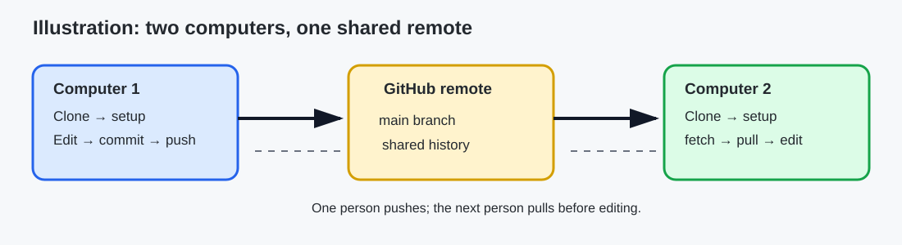
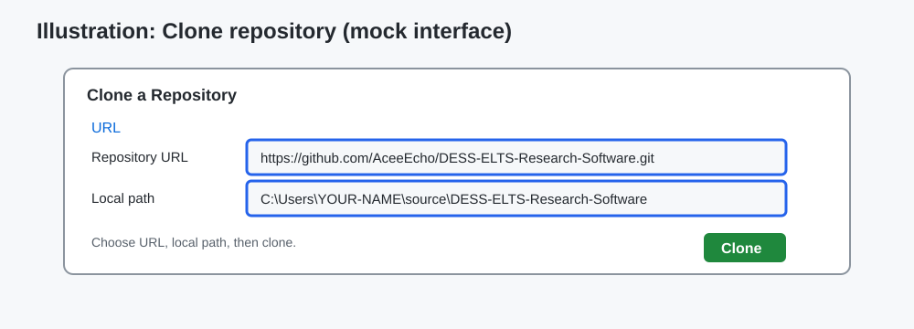
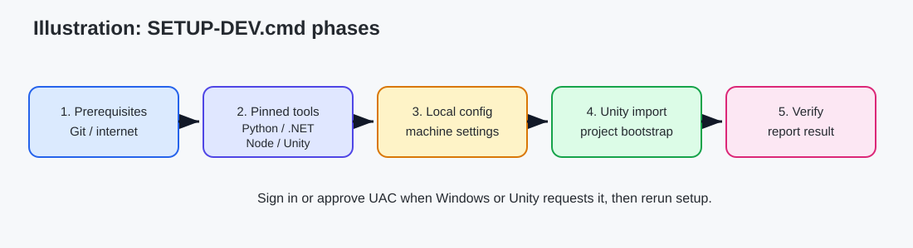
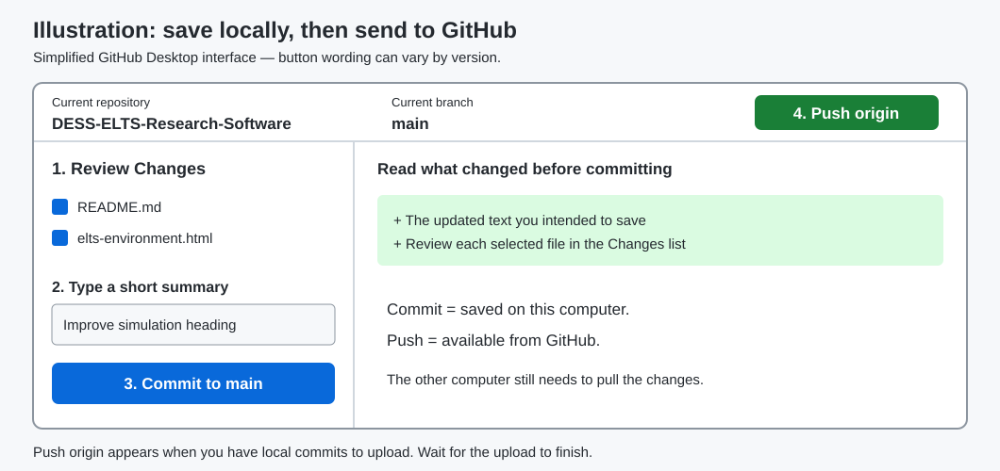
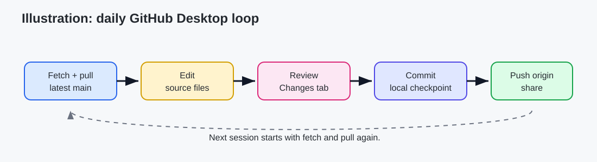

# ELTS setup on more than one Windows computer

This guide gets a beginner from a new Windows computer to the same editable ELTS software repository on two or more machines. It covers the Unity project in `unity/`, the offline browser simulation in `elts-simulation/`, and the analysis and supporting folders in this repository.

The recommended path uses GitHub Desktop. It keeps the repository in a normal local folder such as `C:\Users\YOUR-NAME\source\DESS-ELTS-Research-Software` and uses the included `SETUP-DEV.cmd` to prepare developer tools. The setup script detects what is already installed and downloads missing supported Python, the pinned .NET SDK, pinned Node.js for the browser build, and Unity Hub plus Unity `6000.3.23f1` LTS when needed. Downloads come from official sources and are checksum verified; `winget` is not required. Windows may ask for administrator approval, and Unity may ask you to sign in or accept a license. If a sign-in is required, finish it and run the setup script again.



The illustrations in this guide are labelled diagrams, not screenshots. Menu names can change slightly between GitHub Desktop versions. For current GitHub Desktop instructions, see [Setting up GitHub Desktop](https://docs.github.com/en/desktop/installing-and-authenticating-to-github-desktop/setting-up-github-desktop), [Cloning a repository from GitHub to GitHub Desktop](https://docs.github.com/en/desktop/adding-and-cloning-repositories/cloning-a-repository-from-github-to-github-desktop), and [Syncing your branch](https://docs.github.com/en/desktop/contributing-and-collaborating-using-github-desktop/syncing-your-branch).

## Before you begin

You need a GitHub account with access to [AceeEcho/DESS-ELTS-Research-Software](https://github.com/AceeEcho/DESS-ELTS-Research-Software), an internet connection for the initial downloads, and permission to install software on each computer. GitHub Desktop supports Windows 10 64-bit or later; check the [current supported systems](https://docs.github.com/en/desktop/installing-and-authenticating-to-github-desktop/installing-github-desktop) if your machine is older.

Choose a local folder outside OneDrive, Dropbox, or another synchronised folder. For example: `C:\Users\YOUR-NAME\source`. Git is the synchronisation mechanism for source files. Unity's `Library/` cache and other generated files can be large and are intentionally ignored; they are recreated locally. Setup saves detected tool paths in `config/local/development-tools.json` (ignored) and preserves an existing `config/local.json`. Keep personal notes and machine-specific settings local. Do not put passwords, tokens, private measurements, or other private data in the repository.

What the words mean:

| Term | Plain meaning |
| --- | --- |
| Repository (repo) | The project files plus their Git history. |
| Remote | The copy hosted on GitHub. |
| Local clone | Your editable copy on one computer. Each computer has its own clone. |
| Commit | A named checkpoint of changes in your local clone. |
| Push | Send your local commits to GitHub. |
| Fetch | Check GitHub for newer commits. |
| Pull | Fetch and apply newer commits to your local files. |

There is no automatic sync. Before editing on a computer, pull the latest `main`. Do not independently edit the same `main` branch on two computers at once; finish and push on one computer first, then pull on the other.

## First computer: install, clone, and set up

### 1. Install and sign in to GitHub Desktop

1. Download GitHub Desktop from [desktop.github.com](https://desktop.github.com/), install it, and open it.
2. Sign in with the GitHub account that can access the ELTS repository. In Windows, the account controls are under **File > Options > Accounts**.
3. If GitHub Desktop offers to configure your Git name and email, use the identity you want shown on your commits. Never type a GitHub password into a repository file or a setup prompt.

### 2. Clone the repository

1. In GitHub Desktop, choose **File > Clone repository**.
2. Select the **URL** tab. Enter `https://github.com/AceeEcho/DESS-ELTS-Research-Software.git`.
3. Set **Local path** to a nonsynced folder, for example `C:\Users\YOUR-NAME\source\DESS-ELTS-Research-Software`. Replace `YOUR-NAME` with your Windows account folder name. You can use **Choose** to select a folder instead of typing the path; create a `source` folder inside your own user folder if needed.
4. Click **Clone**. In the repository bar, confirm the current branch is `main`.



Do not use **Download ZIP** for an editable multi-machine workflow: a ZIP has no Git history and cannot pull or push changes as a repository. If the repository was already cloned, use **File > Add local repository** and select its folder.

### 3. Run the developer setup

1. In GitHub Desktop, use **Repository > Show in Explorer** to open the cloned folder. Close Unity if this project is open.
2. Double-click `SETUP-DEV.cmd`.
3. Read each prompt. Allow UAC when you understand that Windows is installing the requested developer tools. The installer uses official checksum-verified direct downloads, so it does not depend on `winget`.
4. If Unity Hub asks you to sign in or accept a license, do that in Unity Hub and rerun `SETUP-DEV.cmd`.
5. Wait for the final verification message. The result is ready only after bootstrap, Unity import, and full verification complete. Setup writes diagnostics to `diagnostics/setup-report.json`, with console and Unity import details in `diagnostics/setup-console.log` and `diagnostics/setup-unity-import.log`. These are local diagnostics. `-Check` only detects tools; `-SkipVerification` deliberately leaves the result prepared but unverified.



The setup script does not calibrate the physical ELTS apparatus or prove safety or study readiness. Physical testing equipment is unavailable, so hardware-dependent checks remain deferred. Synthetic tracking, simulated devices, and the offline browser simulation are suitable for development while that equipment is unavailable.

## Open the project

**One-click startup:** double-click `START-ELTS.cmd` in the cloned repository.
It runs setup automatically when needed, builds the synthetic dashboard, and opens
the dashboard and participant game. The Unity Editor is opened manually. On first use, allow time for
installation, import, tests and building; complete any Unity sign-in/license prompts.
Repeat starts reuse the prepared tools and unchanged dashboard. If source changes
require a rebuild while Unity is open, close that project and click the launcher
again. Failure messages stay visible; the log is `diagnostics/start-console.log`.
You can still use the manual editor-opening instructions below.

For Unity, open Unity Hub, choose **Add/Open existing project**, and select the repository's `unity/` folder. Use Unity `6000.3.23f1` LTS exactly. If Hub offers to open the project with another editor version, stop and install/select the pinned version instead. Unity may spend time rebuilding its local cache; that cache is machine-specific and is not pushed.

For the browser simulation, open `elts-simulation/README.md` and follow its current instructions. The source page is `elts-simulation/elts-environment.html`; `index.html` may be generated. Keep the simulation offline and do not treat its synthetic geometry as measured calibration.

To open a development shell with the detected private tool paths, double-click `OPEN-DEV-SHELL.cmd` in the repository root. It opens PowerShell without making permanent `PATH` changes. From that shell, the browser build can run from the repository root:

```powershell
node elts-simulation/build.mjs
```

If you change the toolchain or a developer dependency, rerun `SETUP-DEV.cmd`. You do not need to rerun setup for every source edit.

### A small browser simulation edit

This is a complete beginner exercise that proves the source, build, and review loop:

1. Close Unity before pulling or running setup. Open `elts-simulation/elts-environment.html` in a text editor. Windows Notepad works for this small exercise: choose **File > Open**, change the file type filter to **All files**, and select that file inside your clone. Opening it normally in a browser only shows the page; it does not edit its source.
2. Near the start of the file, find the visible text `ELTS · testing environment` and add ` — local test` to that text. Keep the surrounding `<strong>` tags intact. If you have a later styled revision, change its visible heading instead.
3. Save the file. Double-click `OPEN-DEV-SHELL.cmd`, run `node elts-simulation/build.mjs`, then open `elts-simulation/index.html` in a browser.
4. Confirm the new heading appears. Return to GitHub Desktop, review the changed source and generated files, and commit the intended result.
5. Run `.\scripts\verify.ps1` in the development shell before pushing. Fix any reported issue or ask the maintainer before continuing.
6. Push the commit with **Push origin**. Close the browser and Unity before the next pull; reopen Unity afterward.

## Daily workflow on the first computer

1. Open GitHub Desktop and select the repository.
2. Confirm **Current branch: main**. Click **Fetch origin**, then **Pull origin** if updates are available.
3. Edit the relevant files. Keep each change focused and leave generated caches ignored.
4. Return to GitHub Desktop and review the **Changes** tab. Open changed files and make sure every change is expected.
5. Enter a short commit summary, such as `Improve offline simulation labels`, then click **Commit to main**.
6. Click **Push origin**. Wait until GitHub Desktop reports that the branch is up to date.





A commit is your local checkpoint; it is not visible to collaborators until you push. A push sends commits to the remote; it does not update another computer until that computer fetches and pulls.

## Second computer and later computers

Repeat the installation and sign-in steps on each computer. Clone the same URL into that computer's own nonsynced folder, confirm `main`, close Unity if it is open, and run `SETUP-DEV.cmd`. Open `unity/` with Unity `6000.3.23f1` LTS and use the simulation README for `elts-simulation/`. Reopen Unity after setup has finished.

Before every editing session on the second computer, close Unity and click **Fetch origin**, then **Pull origin**. After editing, review, commit, and click **Push origin**. Repeat this same sequence on every additional computer. Reopen Unity after pulling. Never copy the `.git` folder by hand, merge two independent local copies by dragging files over one another, or rely on OneDrive to synchronise a working tree.

## If something goes wrong

**GitHub Desktop cannot sign in or clone.** Check that the browser is signed in to the correct GitHub account and that the repository URL is exactly `https://github.com/AceeEcho/DESS-ELTS-Research-Software`. Ask the repository owner to grant access if the page is unavailable. Do not paste passwords or access tokens into chat or files.

**Git is missing.** GitHub Desktop normally includes the Git it needs. Restart GitHub Desktop after installation. The command-line alternative below requires Git for Windows; install it from [git-scm.com](https://git-scm.com/download/win) only if you need that workflow.

**Setup cannot download or verify a tool.** Check the network connection and the setup report. Do not replace a checksum-verified download with an untrusted mirror. Save the final error text for the project maintainer and rerun `SETUP-DEV.cmd` after the issue is fixed.

**UAC blocks installation.** Use an account allowed to install software or ask the computer administrator. Do not bypass UAC. Rerun setup after the administrator has completed the install.

**Unity asks for a license or opens the wrong version.** Sign in to Unity Hub, activate the permitted license, select `6000.3.23f1` LTS, and rerun setup. Do not substitute a nearby Unity patch. Close Unity before rerunning setup.

**Pull reports local changes or a conflict.** Stop and read the list of files. If your changes are not committed, use GitHub Desktop's **Commit to main** after reviewing them, or copy your work to a safe notes folder before asking for help. Do not choose a discard or reset option casually. If a conflict is shown, open each conflicted file, keep the intended complete result, remove the conflict markers (`<<<<<<<`, `=======`, `>>>>>>>`), save, review, commit the resolution, and push. GitHub's [merge conflict guide](https://docs.github.com/en/pull-requests/how-tos/merge-and-close-pull-requests/resolving-a-merge-conflict) explains the markers. When unsure, stop before clicking **Discard changes** and contact the maintainer.

## Short command-line alternative

After installing Git for Windows, PowerShell users can use:

```powershell
$repoPath = Join-Path $env:USERPROFILE 'source\DESS-ELTS-Research-Software'
New-Item -ItemType Directory -Force (Split-Path -Parent $repoPath) | Out-Null
git clone https://github.com/AceeEcho/DESS-ELTS-Research-Software.git $repoPath
Set-Location $repoPath
git switch main
.\SETUP-DEV.cmd
git pull --ff-only origin main
# edit and review files
git status
git add path\to\file
git commit -m "Describe the change"
git push origin main
```

Use `git pull --ff-only` before editing, with Unity closed. If it stops because your working tree is dirty or histories diverged, do not force anything; keep the output and ask the maintainer. GitHub Desktop is the safer beginner workflow.

## What a successful setup means

You should be able to see the repository in GitHub Desktop, see `main` as the current branch, open `unity/` with Unity `6000.3.23f1` LTS, and open the offline simulation from its README. This is a software setup checkpoint. It does not claim that physical equipment has been calibrated, that hardware tests passed, or that any ELTS study gate is complete.
